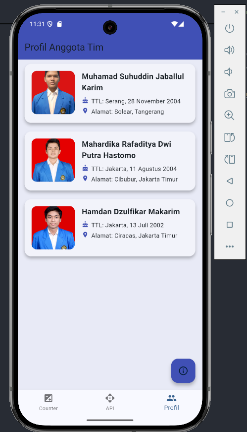
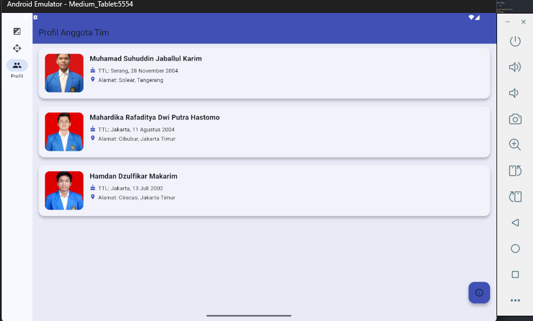

# flutter_aplikasi_sederhana
# Aplikasi Flutter Adaptive Responsive dengan Floating Action Button.

## Nama:
Mahardika Rafaditya Dwi Putra Hastomo, NIM: 452210146

## Deskripsi Aplikasi:
Aplikasi ini melanjutkan tugas kelompok yang sebelumnya, kemudian ditambahkan dengan fitur Adaptive Responsive serta menambahkan Floating Action Button.

## Screenshot Emulator:

## Penjelasan Program:
- Program ini menggunakan konsep adaptive dan responsive dalam navigasi antar halaman. 
  Jika aplikasi dijalankan di perangkat dengan layar lebar (seperti tablet), maka navigasi menggunakan NavigationRail di sisi kiri layar. 
  Jika dijalankan di layar kecil (seperti smartphone), maka navigasi menggunakan BottomNavigationBar di bagian bawah layar.
  
- Program ini juga menggunakan Floating Action Button yang mana kalau di program ini untuk menampilkan informasi halaman ini menampilkan apa.

## Cara Menjalankan Aplikasi:
flutter pub get flutter run
