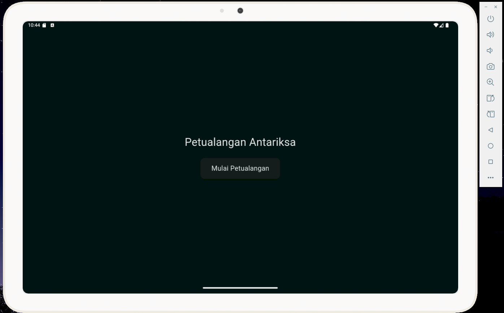
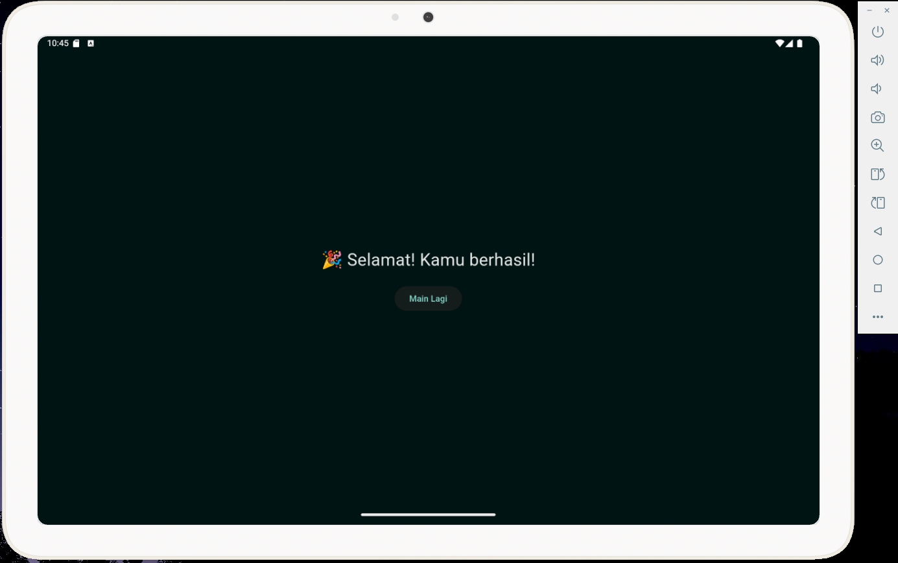

# flutter_buku_cerita_gesture

## Nama:
Mahardika Rafaditya Dwi Putra Hastomo, NIM: 452210146

## Deskripsi Aplikasi:
Petualangan Antariksa adalah aplikasi Flutter berbasis interaktif yang mengajak pengguna mengikuti cerita seorang astronot dalam misi membuka peti misterius di luar angkasa. Pengguna dapat berinteraksi langsung dengan elemen-elemen di layar menggunakan gesture seperti drag, tap, double tap, dan long press untuk menyelesaikan misi.

## Screenshot Emulator:

## Penjelasan Program:
- Title Page
Menampilkan judul "Petualangan Antariksa" dan tombol untuk memulai petualangan. Ketika tombol diklik, halaman berpindah ke InteractiveScenePage.
- Interactive Scene Page 
Halaman inti interaktif tempat pengguna dapat:
    - Double Tap pada karakter astronot 👩‍🚀 untuk memunculkan dialog.
    - Long Press pada box 📦 untuk melihat petunjuk.
    - Drag kunci 🔑 ke arah peti. Jika berhasil mengenai peti, maka peti akan terbuka 🔓 dan cerita berlanjut.
    - Geser (drag) latar belakang untuk menciptakan efek parallax sederhana dengan RawGestureDetector.
- End Page 
Setelah misi berhasil (peti terbuka), pengguna diarahkan ke halaman akhir yang memberi ucapan selamat 🎉 dan tombol untuk mengulang petualangan.

## Cara Menjalankan Aplikasi:
flutter pub get flutter run