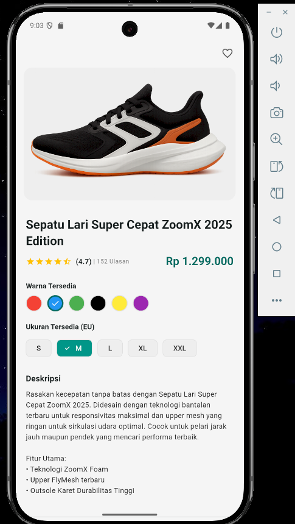
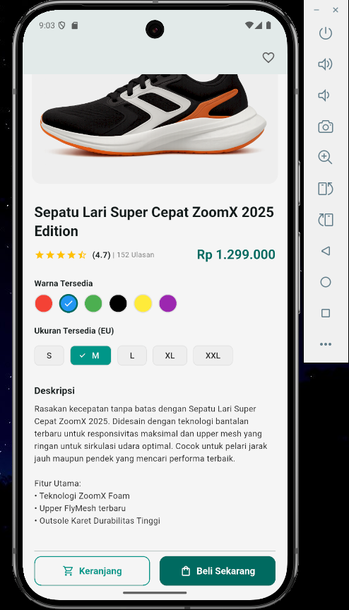
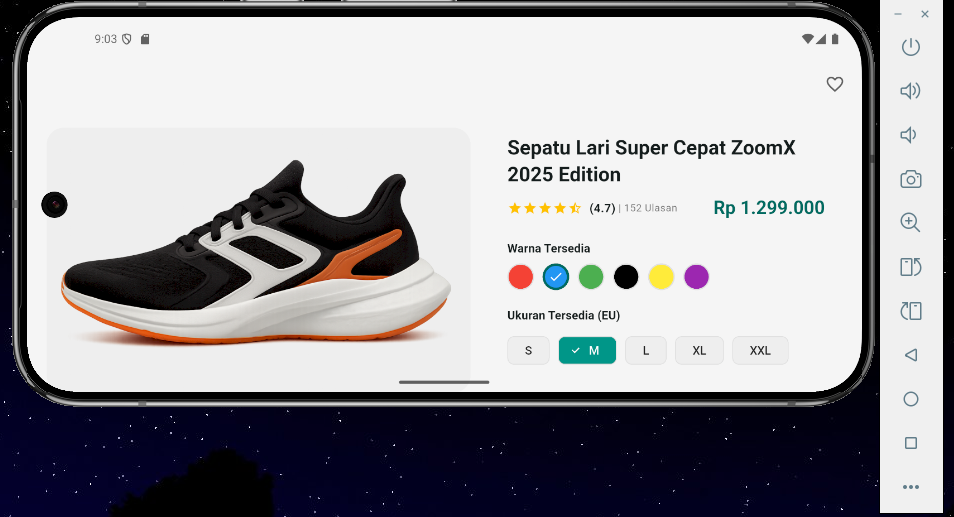
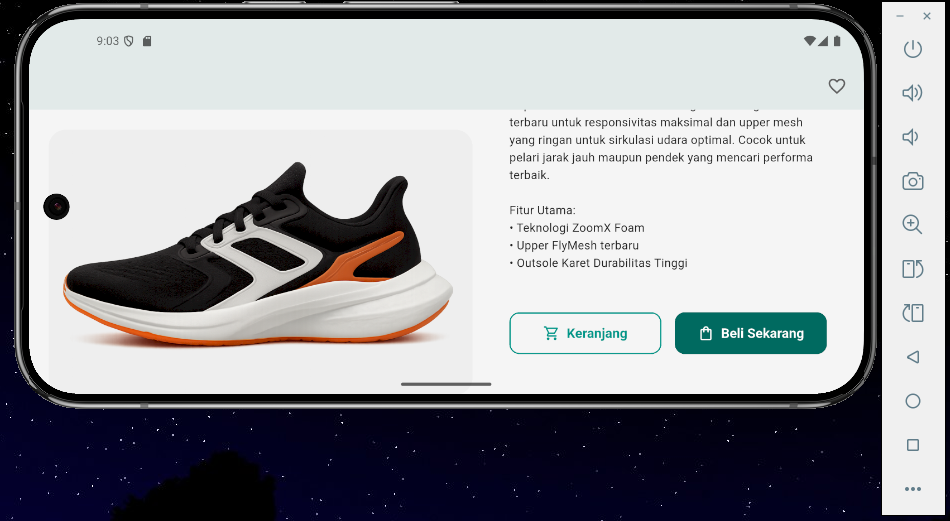

# flutter_layout_halaman_produk

## Nama:
Mahardika Rafaditya Dwi Putra Hastomo, NIM: 452210146

## Deskripsi Aplikasi:
Aplikasi ini adalah aplikasi tampilan detail produk e-commerce, dirancang menggunakan Flutter dengan pendekatan layout responsif untuk tampilan mobile dan tablet/web. Aplikasi ini menampilkan informasi detail tentang suatu produk, termasuk gambar produk, nama produk, rating, harga, pilihan warna, pilihan ukuran, deskripsi produk, dan tombol aksi seperti "Keranjang" dan "Beli Sekarang".

## Screenshot Emulator:

## Penjelasan Program:
- Aplikasi dibuat menggunakan Flutter dengan bahasa pemrograman Dart.
- Menampilkan halaman detail produk sepatu seperti pada aplikasi e-commerce.
- Gambar sepatu ditampilkan menggunakan Image.asset dari folder assets/images.
- Informasi produk mencakup nama sepatu, harga, dan rating dengan ikon bintang.
- Fitur pilihan warna dan ukuran sepatu menggunakan setState untuk memperbarui tampilan saat dipilih.
- Warna ditampilkan sebagai lingkaran; ukuran ditampilkan sebagai ChoiceChip.
- Deskripsi produk ditampilkan di bagian bawah untuk memberikan informasi tambahan.
- Terdapat dua tombol aksi: Tambah ke Keranjang dan Beli Sekarang.
- Desain interface disusun dengan widget seperti Scaffold, Column, Row, Padding, dan SizedBox.`

## Cara Menjalankan Aplikasi:
flutter pub get flutter run