# flutter_mini_habit_tracker

## Nama:
Mahardika Rafaditya Dwi Putra Hastomo, NIM: 452210146

## Tujuan Praktikum:
Mempelajari dan mengimplementasikan manajemen data lokal sederhana di Flutter tanpa database eksternal. Praktikum ini juga bertujuan untuk memahami penggunaan `StatefulWidget`, dialog dinamis, dan perubahan tema (light/dark mode) dalam aplikasi.

## Deskripsi Aplikasi:
Aplikasi ini merupakan *Habit Tracker Mini* yang memungkinkan pengguna untuk menambahkan, mengedit, menghapus, dan menandai kebiasaan harian (habits) yang telah dilakukan. Data habit dimuat dari file lokal `assets/habits.json`, dan pengguna dapat mengatur status masing-masing habit secara manual.

## Screenshot Emulator:
### Tampilan Umum
- Halaman utama aplikasi
  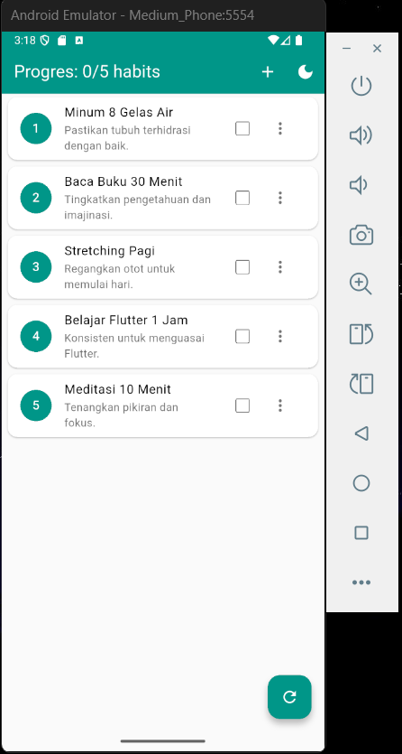

### Interaksi Tambah/Edit Habit
- Tombol tambah habit
  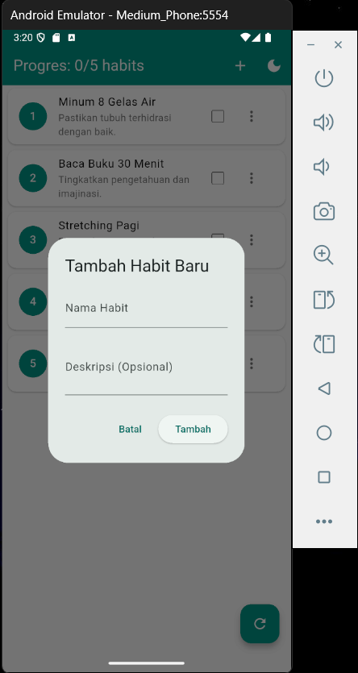
- Form isi habit
  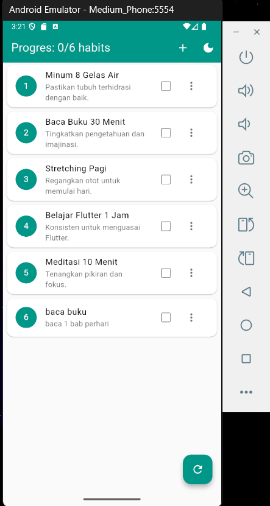
- Form kosong (validasi error)
  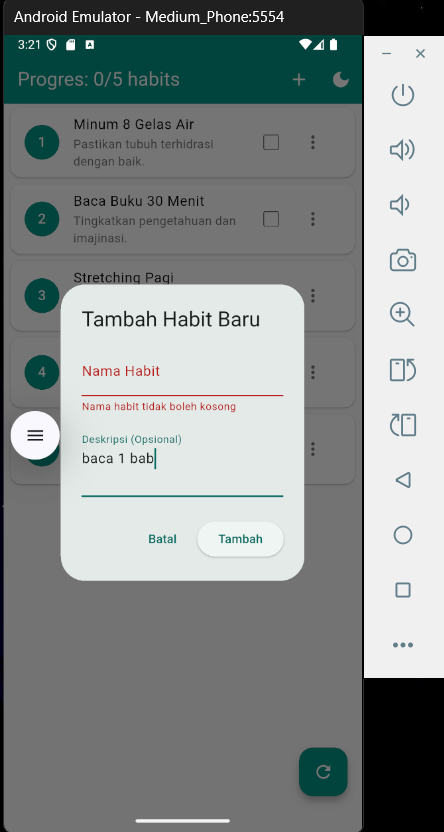
- Hasil setelah edit habit
  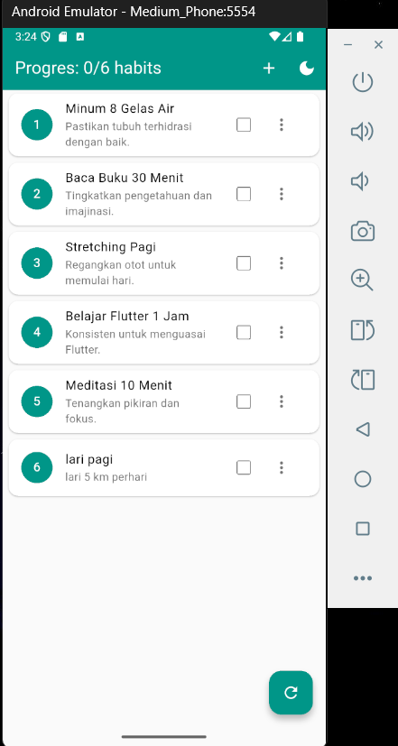
- Edit habit dialog
  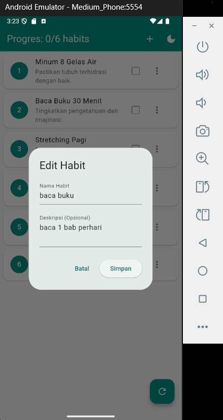

### Penghapusan Habit
- Ikon tiga titik untuk opsi habit
  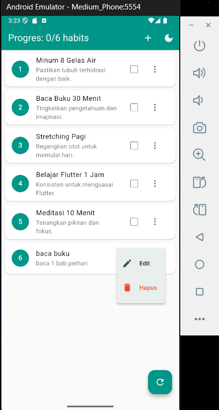
- Dialog konfirmasi hapus
  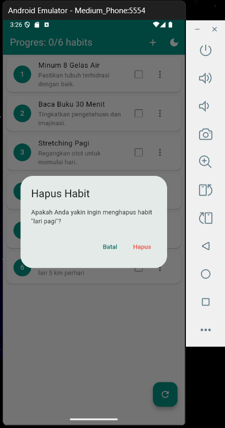
- Tampilan setelah habit dihapus
  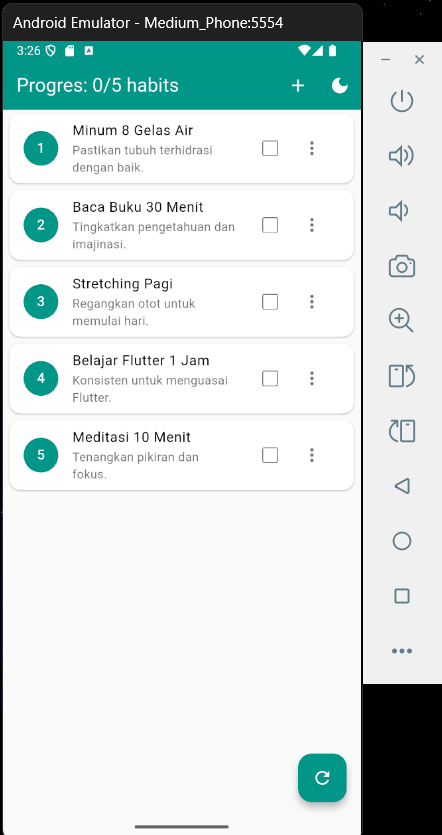

### Fitur Checkbox & Reset
- Uji coba centang habit (strikethrough)
  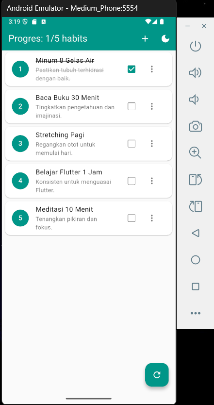
- Progres bar kebiasaan yang sudah dilakukan
  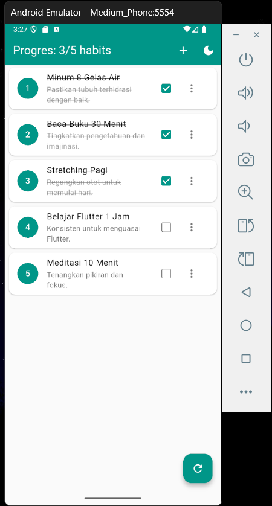
- Reset checkbox
  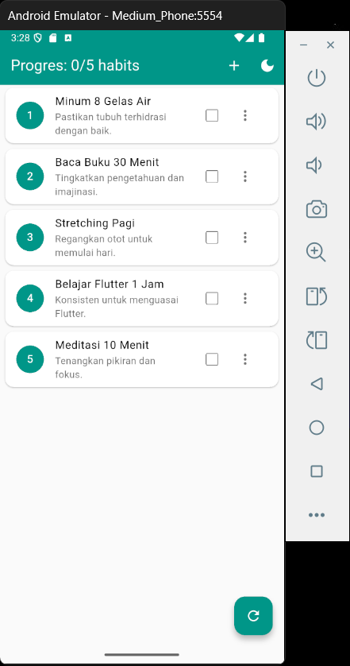

### Debugging Console Output
- Debug saat menambahkan habit
  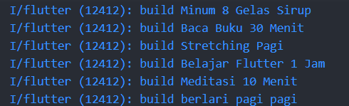
- Debug saat mengedit habit
  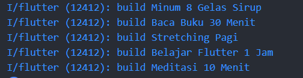
- Debug saat menghapus habit
  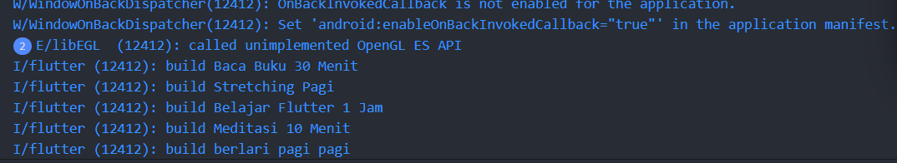
- Debug pengecekan kondisi tertentu
  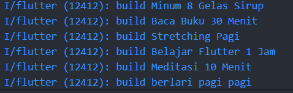

### Uji State & Efek UI
- Efek ephemeral state
  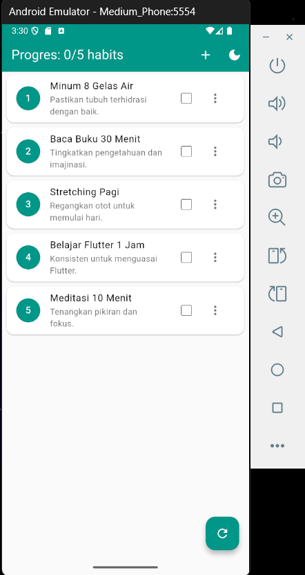

## Penjelasan Program:
- Aplikasi dibangun menggunakan **Flutter** dan bahasa pemrograman **Dart**.
- Fitur utama:
  - **Tambah Habit**: Melalui tombol `+` atau ikon di AppBar, pengguna bisa menambahkan habit baru melalui dialog dengan validasi form.
  - **Edit Habit**: Tekan ikon menu (⋮) lalu pilih “Edit” untuk mengubah nama atau deskripsi habit.
  - **Hapus Habit**: Akses opsi “Hapus” dari menu yang sama, dengan konfirmasi dialog sebelum penghapusan.
  - **Checkbox**: Menandai apakah habit telah dilakukan.
  - **Reset**: Tombol `refresh` akan menghapus semua tanda centang.
  - **Tema Gelap/Terang**: Toggle tema langsung dari AppBar menggunakan ikon lampu/gelap.
- Desain menggunakan kombinasi warna adaptif tergantung tema (light/dark) dengan tampilan bersih dan interaktif.
- Data dimuat dari file `assets/habits.json` menggunakan `DefaultAssetBundle`, dan parsing dilakukan dengan `jsonDecode`.
- ID habit baru dihasilkan secara otomatis berdasarkan nilai ID terbesar saat ini menggunakan fungsi `max`.

## Cara Menjalankan Aplikasi:
flutter pub get flutter run