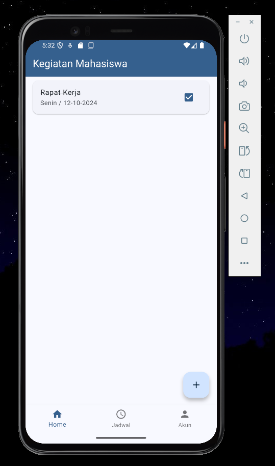
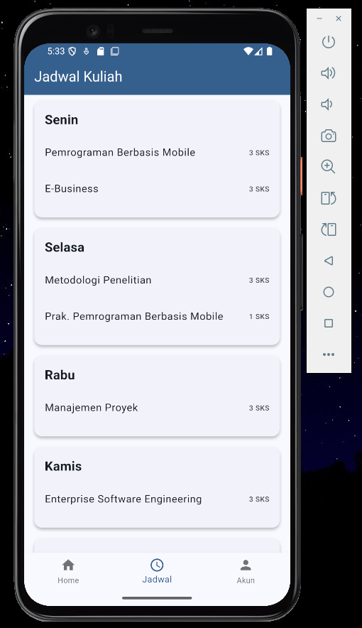
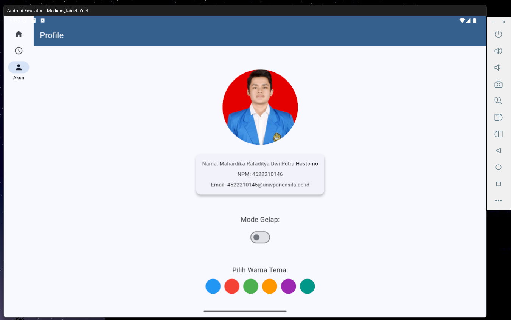
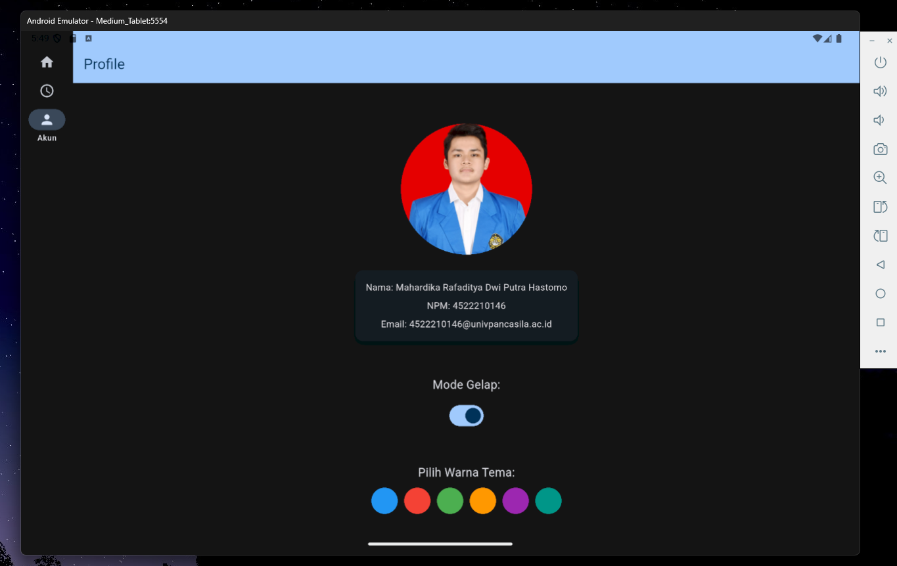
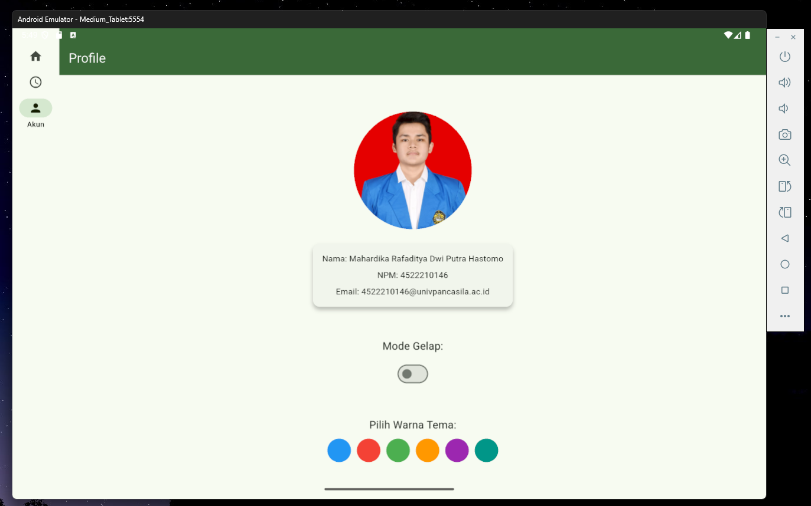

# flutter_uts_aplikasi_jadwal_kuliah_dan_kegiatan_mahasiswa_adapatif_interaktif

## Nama:
Mahardika Rafaditya Dwi Putra Hastomo, NIM: 452210146

## Deskripsi Aplikasi:
Aplikasi ini berfungsi sebagai manajemen kegiatan dan jadwal mahasiswa. Fitur-fitur baru yang ditambahkan antara lain: tampilan adaptif dan responsif, pengaturan tema (gelap/terang), penggantian warna tema, serta penggunaan Floating Action Button untuk menambahkan kegiatan secara dinamis.

## Screenshot Emulator:

## Penjelasan Program:
- Program ini menggunakan NavigationRail untuk layar lebar (tablet) dan BottomNavigationBar untuk layar kecil (hp), menyesuaikan ukuran layar secara otomatis.
- Program ini Menampilkan daftar kegiatan mahasiswa. Kegiatan dapat ditambah melalui FloatingActionButton dan dihapus otomatis setelah ditandai selesai.
- Program ini menampilkan jadwal kuliah harian lengkap dengan nama mata kuliah dan jumlah SKS.
- Program ini menampilkan informasi pengguna serta menyediakan fitur pengaturan Mode Gelap dan pemilihan warna tema secara dinamis.
- Program ini memiliki fitur darkmode dan fitur ThemeMode dan colorSchemeSeed yang mana pemilihan warna utama aplikasi dapat diubah langsung dari halaman profile.

## Cara Menjalankan Aplikasi:
flutter pub get flutter run